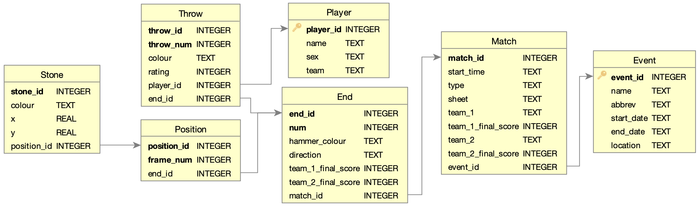

# Curling Shot by Shot Position Parsing

Extraction of curling shot and position data from pdf documents generated by CURLIT.  

[Article on this project](http://nwnht.ca/projects/curling/curling.html) is available on my website [nwnht.ca](http://nwnht.ca).

There is also a notebook: `src/predictions.ipynb` that details making a better deduction of the hammer colour as well as predicting the winning team using player ratings and hammer colour.  HTML and pdf versions are available in `docs/predictions_notebook`.

# Article TLDR:

I have recently become more interested in curling as I spent the time to watch a few matches and began noticing the tactics being employed.  This inspired me to create a dataset of 2100+ curling matches from 2016-2019 and look at some of the patterns that emerge.

### Outline:
1. Gather Data
2. Parse Data
3. Create Database
4. Visualization

## 1. Gather Data

I found a large repository of data from the World Curling Federation(WCF) with the help of an article by Jordan Myslik.  There are 2100+ pdfs showing shot-by-shot breakdowns of curling matches from 2016-2019.  Each page of these documents holds a single end with 1-16 positions shown, one for each throw/shot.  I wrote a couple functions to find and download the documents in download_pdfs.py.

## 2. Parse Data

The document text contains match information that is listed in the header of each page as well as the player, throw type, and throw rating for each shot.  This was extracted by converting the pdf document to xml with the tool [`pdftohtml`](https://pdftohtml.sourceforge.net) and then filtering through the text based on a number of criteria that are further detailed in my article.

The stone positions within each 'frame' were parsed using some of the core functionality of [OpenCV](https://opencv.org) to create masks for the stone colours and find all of the contours.  The contours found were then filtered to find the contours of interest and their locations saved relative to the centre of their respective [house](https://www.rookieroad.com/curling/the-sheet/house/).  

## 3. Create Database

I built a SQLite database with the schema shown below and populated it with the data parsed from the pdf documents.

## 4. Visulization

I created a number of visualizations along with analysis which can be seen in my article.  Below are some of the interesting ones. 

### Throw Location Heatmap by Throw Number

### Throw Type Heatmap

### Example Match Summary

### Rating by Shot Type

### Player Rating vs. Throw Count

